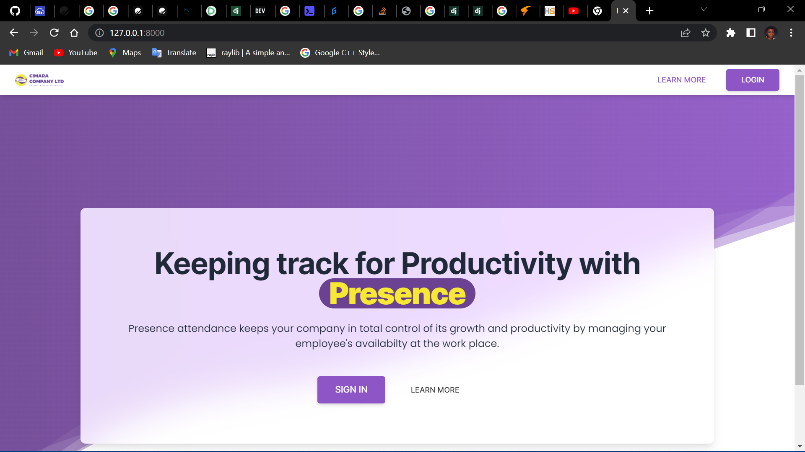

# presence

> Visit [presence here](https://cimara.pythonanywhere.com/)
> Request sample logins credentials to try it out 

presence is a mvp attendance management system for a company called cimara.

Presence Admins can create, edit, and delete user account. The locations of the workplaces are represented with geocoordintaes and a qr code is generated for each location when it is created

Presence provides and interface for employees to 'sign the attendance register' by scanning a qr code when at the workplae premises. This is the QR code that is autogenerated when the admin adds that workplace location. The code is retrieved as well as the employees geolocation and matched with the database date to ensure authentic clocking.

An employee clocks in and out for a day and their attendance is registered for admins to review.

Admins can filter attendances by data as well as view employee attendances on a custom calendar

### Technologies

- Django Web Framework
- TawilwindCSS
- Vanilla JS & JQuery

### Setting it up yourself

- Clone this repo
- Create a python virtual env using venv for py3.9. `python -m venv .`
- Install requirements. `pip install -r requirements.txt`
- Setup a local DB using SQLite by commenting out the current configuration and uncommenting the config for SQLite
- Provide appropriate exports for your env variables in a `.env` file
- Open a terminal and run `python manage.py tailwind start` to setup the tailwind compiler
- Open a second terminal and run `python manage.py makemigrations` and then run `python manage.py migrate` to set up the database
- Run `python manage.py runserver` to start the server on port 8000
- Continue tinkering as you wish

### Contributions and Suggestions
- TO contribute, set up yourself and send in a PR
- To give suggestions, contact me via email on my github profile
